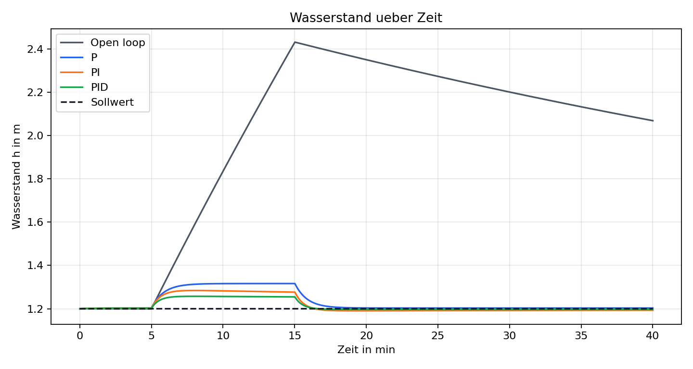
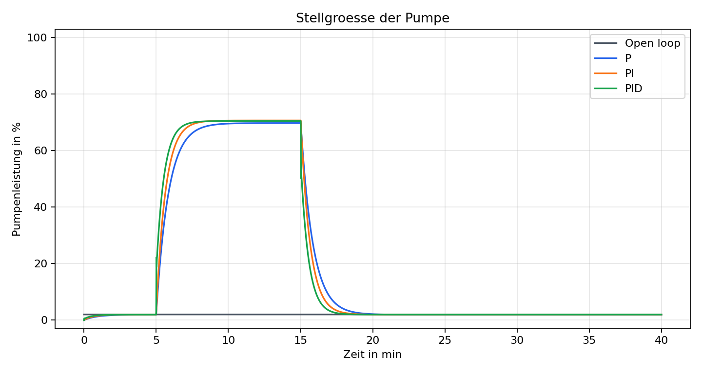

# pid-water-level-control

Simulation einer Wasserstandsregelung fuer ein kleines kommunales Speicherbecken
mit Python. Das Projekt verbindet Modellbildung, diskrete Simulation,
PID-Regelung, Visualisierung und eine saubere `src`-Projektstruktur.


Projektseite:
[https://nikoeller.github.io/pid-water-level-control/](https://nikoeller.github.io/pid-water-level-control/)

## Kurzbeschreibung

Das Repository simuliert einen Pumpensumpf, ein Regenrueckhaltebecken oder ein
kleines Speicherbecken mit Basiszufluss, Regenstoerung, freiem Ablauf und
geregelter Pumpe. Verglichen werden vier Betriebsarten:

1. Ungeregeltes System mit fester Pumpenleistung
2. P-Regler
3. PI-Regler
4. PID-Regler mit Anti-Windup

Die Demo erzeugt automatisch Plots und eine Kennwerttabelle unter `results/`.

## Relevanz fuer Hoch- und Tiefbau / Infrastruktur

Wasserstandsregelung ist ein typisches Schnittfeld aus Elektrotechnik,
Automatisierung und kommunaler Infrastruktur. Pumpensuempfe, kleine
Rueckhaltebecken und Speicheranlagen muessen bei Stoergroessen wie Regen
stabil betrieben werden: Der Pegel soll nicht ueberlaufen, die Pumpe soll nicht
unnoetig laufen, und die Regelung muss mit Stellgrenzen umgehen koennen. Dieses
Projekt bildet genau diese Fragestellung in einer ueberschaubaren Simulation ab.

## Regelungstechnischer Hintergrund

Der Regler arbeitet diskret mit einer festen Abtastzeit. Im Projekt ist der
Fehler als

```math
e_k = h_k - h_{\mathrm{set}}
```

definiert. Ein positiver Fehler bedeutet also: Der Wasserstand ist zu hoch und
die Pumpe soll staerker laufen.

Der PID-Regler berechnet die Stellgroesse aus P-, I- und D-Anteil:

```math
u_k = K_P e_k + K_I \sum_{i=0}^{k} e_i \Delta t
      + K_D \frac{e_k - e_{k-1}}{\Delta t}
```

Die Stellgroesse wird auf den Bereich `0.0 ... 1.0` begrenzt, was einer
Pumpenleistung von 0 bis 100 % entspricht. Der I-Anteil wird begrenzt und bei
Saettigung nur dann weiter integriert, wenn er die Saettigung wieder abbauen
kann. Dadurch wird Integrator-Windup reduziert.

## Systemmodell mit Gleichungen

Das Becken wird als Einzustandsmodell beschrieben. Der Zustand ist der
Wasserstand `h` in Metern:

```math
\frac{dh}{dt} =
\frac{q_{\mathrm{in}}(t) + q_{\mathrm{rain}}(t)
      - q_{\mathrm{out}}(h) - q_{\mathrm{pump}}(u)}{A}
```

mit:

- `A`: effektive Beckenflaeche in m^2
- `q_in`: Basiszufluss in m^3/s
- `q_rain`: zusaetzlicher Regenzufluss als Stoergroesse in m^3/s
- `q_out`: freier Ablauf in m^3/s
- `q_pump`: Pumpenabfluss in m^3/s

Der freie Ablauf wird als einfache Wurzelkennlinie modelliert:

```math
q_{\mathrm{out}}(h) = c \sqrt{h}
```

Die Pumpe ist linear zur normierten Stellgroesse:

```math
q_{\mathrm{pump}}(u) = u \cdot q_{\mathrm{pump,max}}, \quad 0 \le u \le 1
```

Die diskrete Simulation nutzt ein explizites Euler-Verfahren:

```math
h_{k+1} = h_k + \Delta t \cdot \frac{dh}{dt}
```

## Installation

```bash
git clone <repository-url>
cd pid-water-level-control
python -m venv .venv
source .venv/bin/activate
python -m pip install --upgrade pip
python -m pip install -e ".[dev]"
```

Alternativ koennen die Laufzeitabhaengigkeiten mit `requirements.txt`
installiert werden:

```bash
python -m pip install -r requirements.txt
```

## Demo ausfuehren

```bash
python examples/run_pid_demo.py
```

Die Demo speichert folgende Dateien in `results/`:

- `water_level_over_time.png`
- `setpoint_vs_actual_pid.png`
- `pump_command_over_time.png`
- `inflow_disturbance.png`
- `controller_comparison.png`
- `metrics_summary.csv`

## Beispielplots

### Wasserstand ueber Zeit



### Pumpenleistung



### Vergleich P / PI / PID


## Ergebnisse

Die aktuelle Demo nutzt ein 40-minuetiges Szenario mit einem Regenereignis
zwischen Minute 5 und Minute 15. Die Kennwerte werden reproduzierbar aus der
Simulation berechnet:

| Regler | Ueberschwingen [m] | Einschwingzeit [s] | Stationaerer Fehler [m] | Energie [kWh] |
| --- | ---: | ---: | ---: | ---: |
| Ungeregelt | 1.2309 | - | 0.8871 | 0.0200 |
| P | 0.1162 | 975.0 | 0.0032 | 0.1887 |
| PI | 0.0843 | 931.0 | -0.0071 | 0.1914 |
| PID | 0.0574 | 919.0 | -0.0022 | 0.1910 |

Der ungeregelte Betrieb zeigt einen starken Pegelanstieg. Die geregelten
Varianten halten den Wasserstand deutlich naeher am Sollwert. In dieser
manuell abgestimmten Beispielsimulation reduziert der PID-Regler das
Ueberschwingen und den mittleren Fehler, ohne die Pumpenenergie wesentlich
gegenueber PI zu erhoehen.

## Projektstruktur

```text
pid-water-level-control/
|-- src/water_level_control/
|   |-- tank_model.py
|   |-- pid.py
|   |-- simulation.py
|   |-- metrics.py
|   `-- plotting.py
|-- examples/
|   `-- run_pid_demo.py
|-- tests/
|   |-- test_pid.py
|   `-- test_tank_model.py
|-- docs/
|   |-- index.md
|   |-- theory.md
|   `-- results.md
|-- results/
|-- .github/workflows/tests.yml
|-- pyproject.toml
|-- requirements.txt
`-- README.md
```

## Tests

```bash
python -m pytest
```

Die Tests pruefen unter anderem:

- PID-Reaktion auf positive Fehler
- Begrenzung des I-Anteils
- Anti-Windup bei gesaettigter Stellgroesse
- physikalische Grenzen des Tankmodells
- konsistente Ergebnisarrays der Simulation

## GitHub Pages

Der Ordner `docs/` ist als einfache statische Dokumentation vorbereitet. In den
Repository-Einstellungen kann GitHub Pages auf `main` und `/docs` gesetzt
werden. Die Dokumentation enthaelt eine kurze Projektuebersicht, Theorie und
Ergebnisse mit eingebundenen Plots.

## Moegliche Erweiterungen mit Arduino/Raspberry Pi

- Ultraschallsensor oder Drucksensor zur realen Pegelmessung
- PWM-Ansteuerung einer kleinen DC-Pumpe
- Raspberry Pi als Datenlogger und Visualisierungseinheit
- Arduino als einfacher Echtzeit-Regler mit serieller Ausgabe
- Vergleich zwischen simuliertem Modell und Messdaten eines kleinen
  Versuchsaufbaus
- Erweiterung um Zweipunktregelung, Feedforward oder adaptive Parameter

## Was ich dabei demonstriere

Dieses Projekt zeigt, dass ich ein technisches System in ein erklaerbares Modell
uebersetzen, einen diskreten Regler implementieren, Stoergroessen simulieren und
die Ergebnisse mit sinnvollen Kennwerten bewerten kann. Gleichzeitig zeigt die
Repository-Struktur, dass ich Python-Code modular schreibe, Tests verwende und
ein Projekt so dokumentiere, dass es als Portfolio-Arbeit nachvollziehbar ist.
