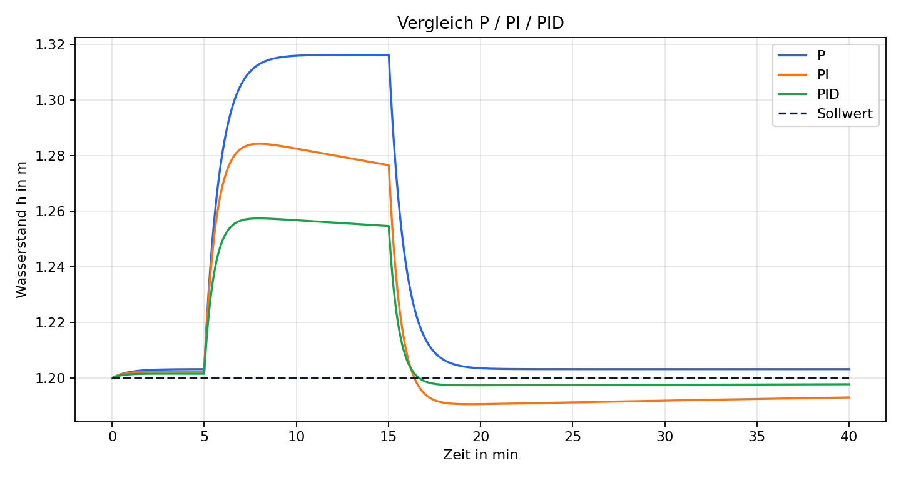

# pid-water-level-control

Dieses Projekt simuliert die Wasserstandsregelung eines kleinen Pumpensumpfs,
Regenrueckhaltebeckens oder Speicherbeckens. Im Mittelpunkt stehen ein
erklaerbares Tankmodell, ein diskreter PID-Regler und eine reproduzierbare
Auswertung mit Kennwerten und Plots.

## Inhalt

- [Regelungstechnischer Hintergrund](theory.md)
- [Simulationsergebnisse](results.md)

## Szenario

Das Becken besitzt einen Basiszufluss, einen freien Ablauf und eine Pumpe mit
begrenzter Stellgroesse von 0 bis 100 %. Zwischen Minute 5 und Minute 15 wird
ein ploetzlicher Regenzufluss als Stoergroesse aufgeschaltet. Verglichen werden
ein ungeregelter Betrieb, ein P-Regler, ein PI-Regler und ein PID-Regler.

## Demonstrierte Punkte

- Modellbildung eines kommunalen Wasserbau-Systems als dynamisches System
- Diskrete Simulation mit fester Abtastzeit
- PID-Regelung mit Stellgroessenbegrenzung und Anti-Windup
- Reproduzierbare Visualisierung mit `numpy`, `pandas` und `matplotlib`
- Saubere Python-Projektstruktur mit Tests und GitHub Actions
