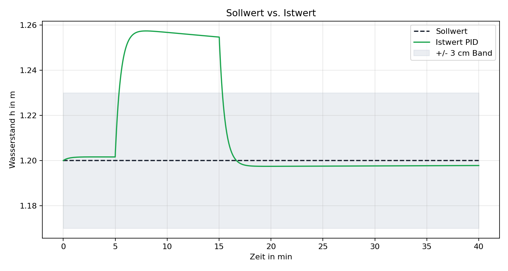
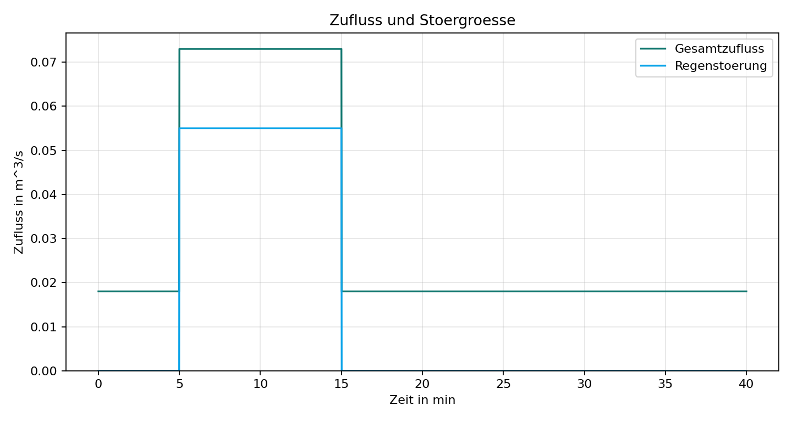

# Ergebnisse

Die Demo wurde mit einem 40-minuetigen Szenario gerechnet. Zwischen Minute 5 und
Minute 15 tritt ein zusaetzlicher Regenzufluss auf. Die folgenden Kennwerte
stammen aus `results/metrics_summary.csv`.

| Regler | Ueberschwingen [m] | Einschwingzeit [s] | Stationaerer Fehler [m] | Energie [kWh] |
| --- | ---: | ---: | ---: | ---: |
| Ungeregelt | 1.2309 | - | 0.8871 | 0.0200 |
| P | 0.1162 | 975.0 | 0.0032 | 0.1887 |
| PI | 0.0843 | 931.0 | -0.0071 | 0.1914 |
| PID | 0.0574 | 919.0 | -0.0022 | 0.1910 |

## Wasserstand

## Sollwert und Istwert

## Pumpenleistung

## Stoergroesse

## Interpretation

Der ungeregelte Betrieb zeigt, warum eine aktive Wasserstandsregelung fuer
kleine Infrastrukturanlagen sinnvoll sein kann: Bei Regen steigt der Pegel stark
an und bleibt deutlich ueber dem Sollwert. Die geregelten Varianten begrenzen
den Wasserstand sichtbar. Der PID-Regler erreicht in dieser Beispielabstimmung
das geringste Ueberschwingen und den kleinsten mittleren Fehler, benoetigt aber
eine aehnliche Pumpenenergie wie PI.
